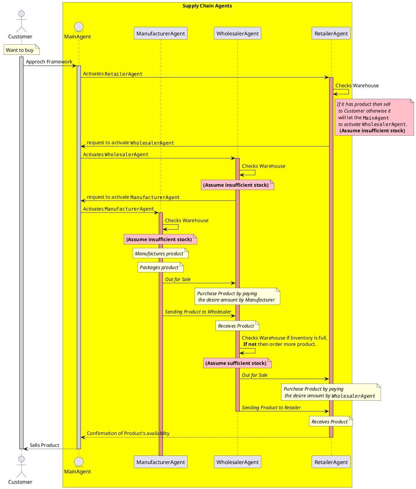
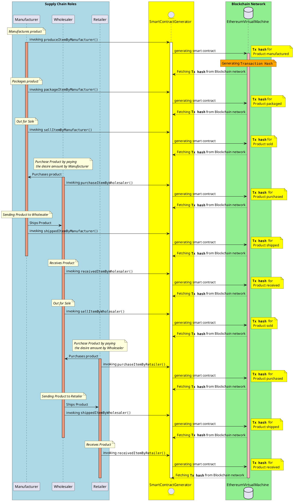
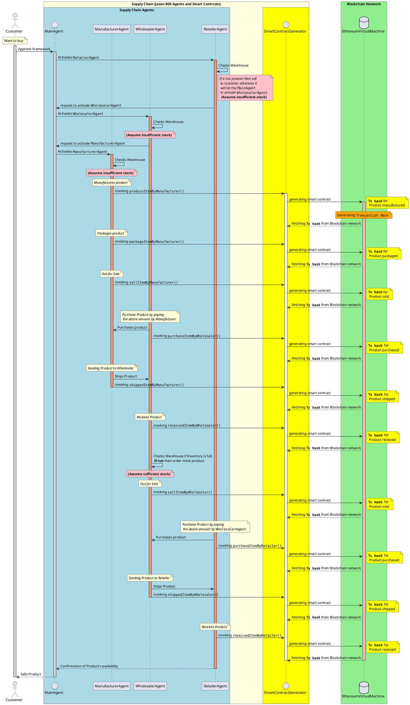

# SMART CONTRACT DEVELOPMENT WITH JASON BDI AGENTS
**Agent-oriented programming** has been developed over the few decades in order to comprehend the relationship between dynamic environments and software applications. 

**Belief-Desire-Intention agents can implement a plan execution library that consists of objectives and goals.** Beliefs are the environmental status, and these agents can update the status of the environment. For instance, weather degree is a dynamic environment variable that can be updated by agents to use with rule-based conditions such as desires and intentions. 

Agents can plan to reach a common goal, which is the fundamental objective for dynamic simulations in various domains such as traffic, transportation, supply chain, and aviation. However, agent-oriented programming follows a different approach than object-oriented programming design, for instance, you can develop rule-based smart applications without using machine learning techniques in an object-oriented language. 

**JASON framework is one of the Belief-Desire-Intention Framework** that comprises Java-based interpreter and AgentSpeak language. A supply chain simulation can be implemented with JASON-based agents and smart contracts. 

A manufacturer, wholesaler, and retailer can realize a product flow. **A retailer can take products from a wholesaler and manufacturer(factory) and a warehouse of the retailer can be updated by rule-based agents upon requesting an order.** This sort of simulation can interact with smart contracts so that one can follow traces of interactions between supply chain network members (retailer, manufacturer, and wholesaler) in a detailed way. Every transaction (operation) between supply chain members are stored in a blockchain network and then one can use this simulation tool without applying an external distributed logging framework.

# Contents
- [Directory Structure](#directory-structure)
- [Sequence DIagram](#sequence-diagrams)
- [MAS Implementation with smart-contracts](#check-agents-with-smart-contracts)

## Overall Class Diagram


# Sequence Diagrams

## Agent Interaction Sequence Diagram



## Smart Contract Sequence Diagram



## Agent and Smart Contract Sequence Diagram



## Test smart Contracts
```
cd smartcontracts/
truffle test --network development
```

**show ganache page also, transaction page**

# Check Agents with smart Contracts

```
cd ..
cd python-Contracts-Agents/
```
Cases:
1. RetailerAgent been asked and it send and sells products because retailer warehouse has sufficient inventory.

```
python3 env.py
```


2. Retailer been asked but retailer warehouse has unsufficient inventory, so ask wholesaleagent, and wholesaler warehouse has sufficient inventory

```
python3 env.py
```


3. Retailer been asked but retailer warehouse has unsufficient inventory, so ask wholesaleragent, and wholesaler warehouse has also insufficient inventory, so ask manufactureragent, and manufacturer warehouse has also sufficient inventory

```
python3 env.py
```


4. Retailer been asked but retailer warehouse has unsufficient inventory, so ask wholesaleragent, and wholesaler warehouse has also insufficient inventory, so ask manufactureragent, and manufacturer warehouse has also insufficient inventory, so manufacture product.

```
python3 env.py
```


## Directory Structure

```
.gitignore
diagrams
images
Master_thesis.pdf
Master thesis
|-- thesis.tex
|-- includes
|  |-- *.tex
|  |-- figures
papers
|-- Related Paper
meeting (Orçun Oruç)
|-- meeting_description.md
|-- small_presentation.pdf
python-Contracts-Agents
|-- asl
|-- env.py
smartcontracts
|-- README.md
|-- package-lock.json
|-- package.json
|-- truffle-config.js
|-- contracts
|  |-- *.sol
|-- migrations
|  |-- 1_initial_migration.js
|  |-- 2_deploy_contracts.js
|-- test
|  |-- TestSupplychain.js
jason
|-- jedit
|-- libs
|-- scripts
|-- jasonAgent
|   |-- src
|   |   |-- asl
|-- supplyChainAgents
|   |-- src
|   |   |-- asl
|   |   |-- main
|   |   |   |-- java
|   |   |   |   |-- thesis
|   |   |   |   |   |-- SupplyChain
|   |   |   |   |   |   |-- SupplyChain.java
|   |   |   |   |   |   |-- accessControl.java
|   |   |   |-- resources
|   |-- supplyChainAgents.mas2j
|   |-- pom.xml
|-- jythonSCAgents
|   |-- src
|   |   |-- asl
|   |   |-- main
|   |   |   |-- java
|   |   |   |   |-- thesis
|   |   |   |   |   |-- SupplyChain
|   |   |   |   |   |   |-- jythonFile.java
|   |   |   |-- resources
|   |-- supplyChainAgents.mas2j
|   |-- pom.xml
```

[Thesis Paper](https://www.overleaf.com/project/62dfc9e6c07bbf02dc82519e)
