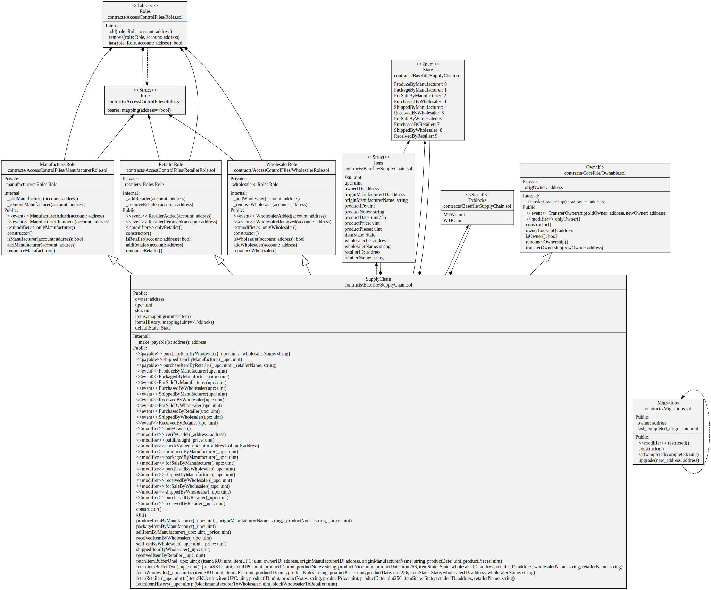

# SMART CONTRACT DEVELOPMENT WITH JASON BDI AGENTS
**Agent-oriented programming** has been developed over the few decades in order to comprehend the relationship between dynamic environments and software applications. 

**Belief-Desire-Intention agents can implement a plan execution library that consists of objectives and goals.** Beliefs are the environmental status, and these agents can update the status of the environment. For instance, weather degree is a dynamic environment variable that can be updated by agents to use with rule-based conditions such as desires and intentions. 

Agents can plan to reach a common goal, which is the fundamental objective for dynamic simulations in various domains such as traffic, transportation, supply chain, and aviation. However, agent-oriented programming follows a different approach than object-oriented programming design, for instance, you can develop rule-based smart applications without using machine learning techniques in an object-oriented language. 

**JASON framework is one of the Belief-Desire-Intention Framework** that comprises Java-based interpreter and AgentSpeak language. A supply chain simulation can be implemented with JASON-based agents and smart contracts. 

A manufacturer, wholesaler, and retailer can realize a product flow. **A retailer can take products from a wholesaler and manufacturer(factory) and a warehouse of the retailer can be updated by rule-based agents upon requesting an order.** This sort of simulation can interact with smart contracts so that one can follow traces of interactions between supply chain network members (retailer, manufacturer, and wholesaler) in a detailed way. Every transaction (operation) between supply chain members are stored in a blockchain network and then one can use this simulation tool without applying an external distributed logging framework.

# Contents
- [Directory Structure](#directory-structure)
- [Implement Smart-contracts](#compile-contract)
- [MAS Implementation using JASON](#jason-agentspeak)

## Overall Class Diagram


## Activity Diagram


## Contract Data Model Diagram


## Contract Sequence Diagram


## Directory Structure

```
.gitignore
README.md
package-lock.json
package.json
truffle-config.js
meeting (Orçun Oruç)
|-- meeting_description.md
|-- small_presentation.pdf
thesis
|-- includes
|-- thesis.tex
papers
|-- Related Paper
python-Contracts-Agents
|-- asl
|-- abi-bin
|-- env.py
smartcontracts
|-- README.md
|-- package-lock.json
|-- package.json
|-- truffle-config.js
|-- contracts
|  |-- ManufacturerRole.sol
|  |-- Migrations.sol
|  |-- Ownable.sol
|  |-- RetailerRole.sol
|  |-- Roles.sol
|  |-- SupplyChain.sol
|  |-- SupplyChainUpgradeable.sol
|  |-- WholesalerRole.sol
|-- migrations
|  |-- 1_initial_migration.js
|  |-- 2_deploy_contracts.js
|-- test
|  |-- TestSupplychain.js
jason
|-- jedit
|-- libs
|-- scripts
|-- jasonAgent
|   |-- src
|   |   |-- asl
|-- supplyChainAgents
|   |-- src
|   |   |-- asl
|   |   |-- main
|   |   |   |-- java
|   |   |   |   |-- SupplyChainEnv.java
|   |   |   |   |-- thesis
|   |   |   |   |   |-- SupplyChain
|   |   |   |   |   |   |-- SupplyChain.java
|   |   |   |   |   |   |-- accessControl.java
|   |   |   |-- resources
|   |-- supplyChainAgents.mas2j
|   |-- pom.xml
diagrams
gantt chart
images
```

[Thesis Paper](https://www.overleaf.com/project/62dfc9e6c07bbf02dc82519e)
