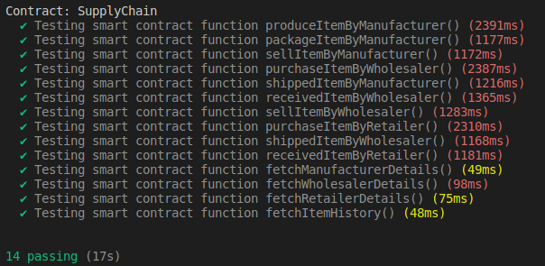

# SMART CONTRACT DEVELOPMENT WITH JASON BDI AGENTS
**Agent-oriented programming** has been developed over the few decades in order to comprehend the relationship between dynamic environments and software applications. 

**Belief-Desire-Intention agents can implement a plan execution library that consists of objectives and goals.** Beliefs are the environmental status, and these agents can update the status of the environment. For instance, weather degree is a dynamic environment variable that can be updated by agents to use with rule-based conditions such as desires and intentions. 

Agents can plan to reach a common goal, which is the fundamental objective for dynamic simulations in various domains such as traffic, transportation, supply chain, and aviation. However, agent-oriented programming follows a different approach than object-oriented programming design, for instance, you can develop rule-based smart applications without using machine learning techniques in an object-oriented language. 

**JASON framework is one of the Belief-Desire-Intention Framework** that comprises of Java-based interpreter and AgentSpeak language. A supply chain simulation can be implemented with JASON-based agents and smart contracts. 

A manufacturer, wholesaler, and retailer can realize a product flow. **A retailer can take products from a wholesaler and manufacturer(factory) and a warehouse of the retailer can be updated by rule-based agents upon requesting an order.** This sort of simulation can interact with smart contracts so that one can follow traces of interactions between supply chain network members (retailer, manufacturer, and wholesaler) in a detailed way. Every transaction (operation) between supply chain members are stored in a blockchain network and then one can use this simulation tool without applying an external distributed logging framework.

## Activity Diagram 


## Overall Class Diagram


## Contract Data Model Diagram


## Contract Sequence Diagram


## Compile Contract
```
truffle compile
```

## Deploy Contract
```
truffle migrate --network <network-name>
truffle migrate --network <network-name> --reset --all
```
Availaible networks: `development`, `rinkeby`,  `alfajores`

*Note: Multiple network configuration can be find inside `truffle-config.js`*
## Test Contract
```
truffle test --network <network-name>
```
Sample Usage
```
truffle test --network sampledevelopment
```


### Generate java wrapper class web3j
```
web3j generate truffle --truffle-json /home/mostakim/thesis/build/contracts/SupplyChain.json -o /home/mostakim/thesis/jason/supplyChainAgents/src/main/java -p thesis.SupplyChain
```

## JASON (AgentSpeak)
Install JASON from [here](https://github.com/jason-lang/jason/blob/master/doc/tutorials/getting-started/shell-based.adoc).

set the Jason home directory with the following command:
```
export JASON_HOME=~/thesis/jason/
export PATH=$JASON_HOME/scripts:$PATH
```
## Multi-Agent Flow Chart


### Run Agent File
```
jason ~/thesis/jason/agents/agents.mas2j
```

### Run Agent on IDE
```
jason-ide
```

[Thesis Paper](https://www.overleaf.com/project/62dfc9e6c07bbf02dc82519e)