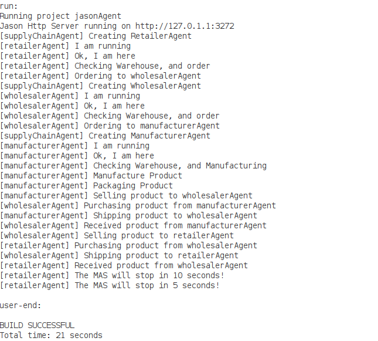

- merely to test the `asl` files without smart contracts, I created this folder.
- Includes `asl` directory containing all the `asl` files
- Consist of 4 agents, `SupplyChainAgents` initiates `RetailerAgent`, `WholesalerAgent` and `ManufactureAgent`
```
MAS jasonAgent {
    agents: supplyChainAgent;
    aslSourcePath:
                "src/asl";
}
```
- Running of MAS shows:
  