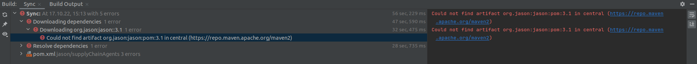
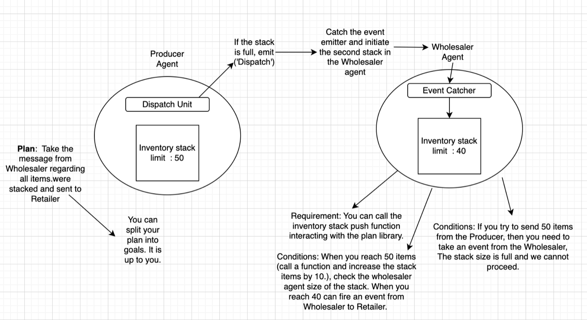

# Meeting Description

## 1st meeting (21st September 2022) [15:05 - 15:25]

- Discussed the current implementations and asked about the solution to change contract owner in web3j. <span style="color: yellow"> _(General info)_  </span>
- solution provided ~ Proxy contract, use cli(not a good option, might have to use shell file or change everytime using cli), interface separator(no good) <span style="color: red"> _(not successful)_  </span>
- increase solidity version to use @openzeppelin/contracts-upgradeable <span style="color: green"> _(done)_  </span>
- also asked to create 1 agent at a time (e.g. retailer agent) and check if it's running by checking string <span style="color: green"> _(done)_  </span>


## 2nd meeting (07th October 2022) [09:31 - 09:55]
- Downgrade the solidity version to check the compatibility with gradle <span style="color: orange"> _(Checked several versions for compatibilty, even tried to find compatible version between web3j with Jason)_  </span>
- Put readme.md file for each folder for better understanding <span style="color: green"> _(done)_  </span>
- Write the directory structure <span style="color: green"> _(done)_  </span>
- asked to write `mailto:infscis.dse@mailbox.tu-dresden.de`  to request for the APPLICATION FORM for **MASTER THESIS** <span style="color: green"> _(done)_  </span>


## 3rd meeting (14th October 2022) [17:00 - 17:15]
- Only has AgentSpeak compiler, compiler error basically, Find AgentSpeak jason compiler that works with java compiler.
- Try with `maven` instead of `gradle`. <span style="color: orange"> _(tried but didn't work)_  </span>

_(click on **supplyChainAgents** directory > **Add Framework Support** > click on **Maven**)_

`**error: could not find artifact org.jason:jason:pom:3.1 in central (https://repo.maven.apache.org/maven2)`

- Start writing paper.

## 4th meeting (21st October 2022) [10:00-10:20]
- Check for how to add jar files locally and try maven again. <span style="color: green"> _(done)_  </span>
**Remove** ```<scope>runtime</scope>``` and **Add** in _pom.xml_:
```
<scope>system</scope>
<systemPath>/home/mostakim/Agents-SmartContract-Development/jason/libs/jason-3.1.jar</systemPath>
```
maven file build successful, but the same issue still persists regarding _package error_ while running _AGENTS_.
- Put the **related papers** inside folder in repository <span style="color: green"> _(done)_  </span>
- Take more notice on case studies, do intensive research. <span style="color: yellow"> _Still doing_  </span>

## 5th meeting (28th October 2022) [09:30-09:35]
- Look for solving the error; more research.
- Check the example how they are using packages (Already checked)
- Tried importing all `.jar` files locally, inside `dir:/jason/libs`
- With both `pom.xml` in maven and `build.gradle` separately.

## 6th meeting (4th November 2022) [09:30-09:45]
- Check https://stackoverflow.com/questions/4955635/how-to-add-local-jar-files-to-a-maven-project <span style="color: green"> _(Tried already)_  </span>
- Check [Python-JASON](https://github.com/niklasf/python-agentspeak) and [ASTRA](http://astralanguage.com/wordpress/) <span style="color: green"> _(Tried already)_  </span>

(**For Python JASON:** 
- _Implementation of Python for the JVM called _Jython_. Jython is an implementation of Python that operates on the JVM and therefore can interact with Java modules. However, very few people work with Jython and therefore you will be a bit on your own about making everything work properly. You would not need to re-write your vanilla Python code (since Jython can interpret Python 2.x) but not all libraries (such as numpy) will be supported._
- _[Inheritance not supported](https://vyper.readthedocs.io/en/v0.1.0-beta.7/frequently-asked-questions.html#what-is-not-included-in-vyper) if change to **Vyper** from **Solidity**)_

(**For ASTRA:** _Definitely check http://astralanguage.com/wordpress/docs/introduction-to-agentspeakl/ 
and http://astralanguage.com/wordpress/using-astra-with-maven/ and http://guide.astralanguage.com/en/latest/introduction/ )_

`check dir: astra-agent/README.md` ASTRA FAILED!
- Try to look alternate solutions. <span style="color: Yellow"> _(Still looking)_  </span>
- Create README file for opinions and error. <span style="color: green"> _(done)_  </span>
- Put the thesis folder as a main one. <span style="color: green"> _(done)_  </span>
- Change repo name, put abbv. Changed to **Agents-SmartContract-Development** <span style="color: green"> _(done)_  </span>

## 7th meeting (11th November 2022) [09:30-09:55]
- Don't use Vyper. <span style="color: green"> _(done)_  </span>
- Use python JASON <span style="color: green"> _(WORKED!!)_  </span>
- wrapper from java to solidity, not in python. No need of wrapper class. 
- Use script for python. <span style="color: green"> _(done)_  </span>
- Try to include everything in thesis paper in the result. <span style="color: Yellow"> _(Still doing)_  </span>

## 8th meeting (18th November 2022) [09:30-09:44]
- Use jython https://www.jython.org/, to run JASON with java and python

Got same error, with `PythonInterpreter` package while running `.mas2j` file

Check `README.md` from `dir:./jason/jythonSCAgent`
- Don't use abi-bin, instead get it direct from `./build/*.json`.  <span style="color: green"> _(done)_  </span>
- Include everything in thesis paper

## 9th meeting (25th November 2022) [09:30- 09:39]
- Asked about the evaluation part from Orcun Oruc
- Asked him to read.

## 10th meeting (2nd December 2022) [09:30- 09:35]
- Asked Orcun tp write comments.
- Write technical details in implementation part. Parameters will be in Evaluation part.
- Include everything in implementation part, jython etc

## 11th meeting (9th December 2022) [09:30- 09:41]
- Comments for thesis papers.
- Comments on testing part
- Needs to be checked 
- Create a temporary folder. Put jason and astra-agent folder in that.

## 1st Review (10.12.2022) 


1. Be careful about the abbreviation. First, use the Belief-Desire-Intention word somewhere in your thesis, and then you can use the BDI abbreviation in the rest of your thesis. (Done)

2. The technical Background part should be updated. Agent, BDI Model (It is a software design pattern), and Agent Programming can be explained in a single subchapter. (Done)
    
3. In the Background, an explanation of the Concept subchapter should be cited. I assume that individualized, ubiquity and Efficient are not your definitions with their internal details. (Done)
    
4. There is no relevancy between Jython and the Background part. You need to explain this in the implementation. (Done)

5. Design and Implementation chapters must be combined. (Done)
    
6. You don’t have research questions or hypotheses. Please define it. 
    
7. You need to define the limits of your research (what are the boundaries of your research).
    
8. The thesis template is wrong on the first page. You need to use the latex format like under this link. https://tu-dresden.de/ing/informatik/smt/cgv/studium/materialien?set_language=en  (Done)
    
9. Qualitative and Quantitative methods are not explained well in the result section. (Performance parameters, tool, and library versions, how did you create your performance experiment? What was your use case ?). Why did you test with different blockchain networks? Is it really necessary and does the result section respond to one of the research questions or not? 
    
10. You can reduce the number of subchapters in the Related Work section. 


## 12th meeting (16th December 2022) [09:30- 09:46]
VERYYYYYYYYYY IMPORTANTTTTTTTTTTTTTTTTTTTT!!!!!!!

- Will decide task description together.
- think of research question and hypothesis. (Idea: use task description)
- Create a question, Which fetaure to implement to Intercat between BDI and MAS. Hoe to Interact bw agent and on chain smart contract. Put it on the introduction. In introduction: Put limit, plans, contribtion, thesis organization. One idea: Relate with current scenerio.
- Important: Answer theoretical part of thesis. Not about technology. Which features need to add to interact BDI with MAS.
- Cretae some question for literature research? Add this to Related work.
- Create Hypothesis. Ask question based on assumption.


## 13th meeting (23rd December 2022) [09:30-09:40]
- Write documention to code.
- Make changes so Orcun can read.
- Add Solidity code format, https://docs.soliditylang.org/en/v0.8.17/natspec-format.html


# WINTER BREAK

## 14th meeting (6th January 2023) [REVIEW SENT on 07.01.2023]
1. You still did not put your research questions. Without research questions, keep writing a thesis is very dangerous.

_reply- Now I have mentioned it at the end of introduction_

2. In the subchapter called “Performance over test networks”, test network comparison is unnecessary for performance evaluation or if necessary, you need to explain which parameters are important. You are focusing on the language, not the blockchain network. You can compare gas costs in different networks, maybe.

_reply- I was trying to go through all the aspects, including why I chosen solidity over Viper, and now also added gascost comparison_

3. First, write your definition, then the abbreviation (Agent-oriented programming - AOP)

_reply- DONE_

4. MAS and Blockchain: Results from a Systematic Literature Review title is not suitable. Systematic Literature Review is a different process than normal literature review and usually, it belongs to Doctoral Work. 

_reply- In RELATED PAPER chapter, the bold bullet points are the name of paper, including MAS and Blockchain: Results from a Systematic Literature Review. I wrote this before starting with mentioning the papers_

5. Figure 4.2, there are some errors in the sequence diagram. The return value should always be demonstrated with a dashed arrow. The supply chain (Yellow box) cannot be an initiator (Probably it is an agent).

_reply- I rectified the diagram, although supply chain (Yellow box) is not an agent or initiator, its just a general role to whom all the data are passed after finishing each process. check "deploy.odt" in this folder, manufacturerole, wholesalerrole, retailerrole, supplychain_

6. In Figure 4.3, what do BaseFile and CoreFile represent? CoreFile assigns an owner address, but it still uses the reference of BaseFile. Why? 

_reply- I rectified the diagram, I designed the diagram earlier accordingly, but you changed the file structure, so i rectified it now_

7. We need concrete literature review questions that address your subchapters under Chapter 2 Related Work. 

_reply- I wrote at the starting of RELATED WORK CHAPTER regarding why we are reading the papers and at the end I added why we are not doing something of our own using BDI agents_


## 15th meeting (13th January 2023) [09:30-10:05]
- write research question before introduction
- calculate gas consumption for function while running them.
- make that as you research question
- add a paragraph for sequence diagram, either sequence diagram or state diagram. change Fig 4.2 name and think about 4.2 diagram also. change 4.3 diagram name. and modify 4.3 too. Read UML book.
- Put literature questions, how OOP is different from AOP. 

### 16th meeting (20th January 2023) [09:30-09:45]
- agent behaviour change to belied desire. Change can, ask how!! combine Q1 and Q3
- Use RQ and LRQ, combine LRQ1 with LRQ2
- Create a sequence diagram
- use gwei (shannon)10 exp 9 mwei (lovelace) 10 exp 6
- change 5.2 and 5.3 and deatail description regarding the numbers.
- Add discuss chapter after result, discuss with yourself.
- Evaluate with Professor(maybe)

### 17th meeting (27th January 2023) [09:30-09:55]
- For Discussion chapter: think about aim, think about RQ and LRQ, intertpret them altogether. Interpret the result.
- Read papers from discussion chapter (Just to be clear).
- MOST IMPORTANTTTTT!!!!!!!!(DISCUSSION CHAPTER) Answer RQ and LRQ in Discussion.
- FIX: 1.Add more related work paper, 2.Change RQ1, HOW TO*! add name of members, delete BDI or fix it.
- Focus on realted work and discussion. Also fix LRQ3 sentence.
- Please compare and create a table and compare in results. Check examples.
Focusing more on interaction, try focus on agent part. 
- LRQ3 can be comparitive analysis.
- Include LightJason

### 18th meeting (3rd february 2023) [09:30-09:10:00]
- Remove the migration from class diagram.  <span style="color: green"> _(done)_  </span>
- One big class diagram for the whole application  <span style="color: orange"> _(doesnt have any class in agents)_  </span>
- About RQ1 can be changed with, (What character we need in smart contract to coordinate it with Belief- Desire- Intention of agents?) <span style="color: green"> _(done)_  </span>
- Use Literature review part to describe the other BDI Agents mentioned in table. <span style="color: green"> _(done)_  </span>
- Remove summary ask direct LRQs, dont mention technologies. <span style="color: green"> _(done)_  </span>
- Check of BDI interpreter, check notation, what algorithm are used for each framework. 

## REVIEW [03.02.2023]

- Related Work should be extended.  <span style="color: green"> _(done)_  </span>
- TxHash cannot be a response in Figure 4.2. Do all of the functions - return the same result? Why do we need different functions then? <span style="color: green"> _(done)_  </span>
- Figure 4.6 should be detailed. What kind of messages? Do you mean events? <span style="color: green"> _(done)_  </span>
- Please add LightJason in the comparison part. What is the difference between frameworks? (Aspect of BDI logic, interpreter, etc.) <span style="color: green"> _(done)_  </span>
- The second research question should be how to. Reorganize the first question again. <span style="color: green"> _(done)_  </span>
- Be careful about spelling mistakes in the framework. For instance, Table 6.1. <span style="color: green"> _(done)_  </span>

### 19th meeting (10th february 2023) [09:30-09:10:00]
- You need to open the simulation from Supply Chain Examples under the example directory in the main screen when you opened AnyLogic Software.
Search for “Supply Chain” example. You need to open a kind of simulation as follows: 

- You can find the queue and stack implementation in Solidity. 
https://programtheblockchain.com/posts/2018/03/23/storage-patterns-stacks-queues-and-deques/

### 20th meeting (17th february 2023) [09:30-09:10:00]
- provide fail goals with -! (But - and + are used to discard or accept belief)
- integrate everything and put results

### 21st meeting (24th february 2023) [09:30-09:10:00]
- Add code snippets to implementation part
- renove technology name from conclusion chapter
- Ask for defence

reviews are as follows:

 -   1.3 and 1.4 is in the wrong place. After 1.2 in the introduction, 1.5 should come after. (Think about this again)
   -   Under chapter 3.4 (Blockchain), 3.4.4 does not belong to the Blockchain part because it is a technology. You can mention this part in the implementation.
   -   Some diagrams (especially sequence diagrams can be moved to the Appendix. But we are going to decide after completing the conclusion chapter)
-  You need to be careful about claiming something like this sentence: JACK Agent Language, a super-set of Java (if possible give a citation - Table 6.1)

  -    You can open a subchapter for related work (or literature review) as a literature review discussion. 
  -    Subchapter 1.3 State-of-the-Art is in the wrong place. Combine it with the related work. 
   -   The background chapter should come before Related Work; otherwise, the purpose of the background chapter would be meaningless. We have three objectives in the Background chapter: 

a) Historical, geographical, and other descriptions of your study data. 

b) Definitions and usages of words and expressions as appropriate to your thesis. 

c) Existing theory and practice for your research topic.

   -   Before you start to discuss literature with your literature questions, you can open a subchapter for it. 